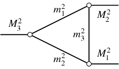

# TriangleSingularity

[](https://mmikhasenko.github.io/TriangleSingularity.jl/stable)
[](https://mmikhasenko.github.io/TriangleSingularity.jl/dev)
[](https://github.com/mmikhasenko/TriangleSingularity.jl/actions)
[](https://github.com/mmikhasenko/TriangleSingularity.jl/actions/workflows/Test.yml?query=branch%3Amain)
[](https://github.com/mmikhasenko/TriangleSingularity.jl/actions/workflows/Lint.yml?query=branch%3Amain)
[](https://github.com/mmikhasenko/TriangleSingularity.jl/actions/workflows/Docs.yml?query=branch%3Amain)

[](https://codecov.io/gh/mmikhasenko/TriangleSingularity.jl)
[](https://doi.org/FIXME)


A simple package that calculates triangle look using the Feynmam approach,
reduced to a single integral.



```julia
triangleloop(m1², m2², m3², M1², M2², M3²)
```


